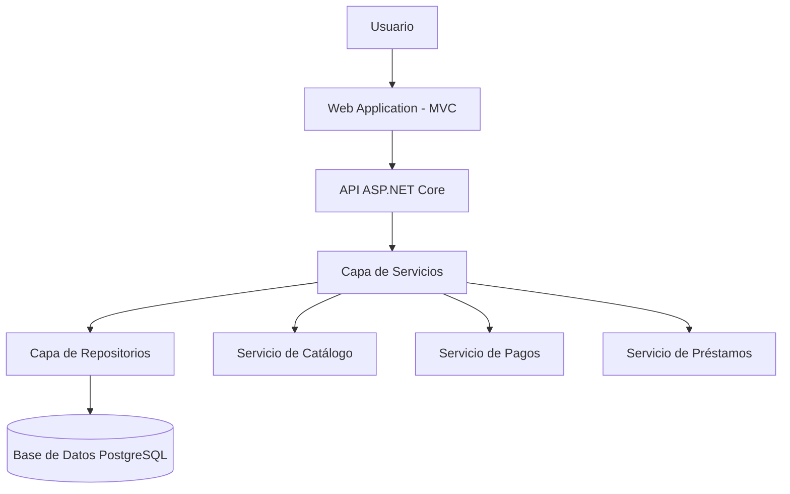

# ADR-01: Selección del estilo arquitectónico basado en arquitectura por capas

| Campo  | Valor |
| ------ | ----- |
| Autor  | Scarlet Angelina Ruelas |
| Fecha  | 12/06/2026 |
| Estado | Aceptado |

---

## Contexto

El proyecto de Biblioteca Digital tiene como objetivo gestionar libros, usuarios, préstamos, reservas y pagos de manera digital y organizada. El sistema debe ser escalable, mantenible y fácil de desarrollar dentro del tiempo académico disponible.

Se requiere definir formalmente el estilo arquitectónico del sistema para garantizar una estructura clara que permita separar responsabilidades y facilitar el mantenimiento del código.

---

## Decisión

Se decidió utilizar el estilo arquitectónico de **arquitectura por capas (Layered Architecture)**, compuesto por:

- Capa de presentación (Web Application - ASP.NET Core MVC)
- Capa de API (ASP.NET Core Web API)
- Capa de servicios (Business Logic)
- Capa de repositorios (Data Access Layer)
- Base de datos (PostgreSQL)

---

## ¿Por qué este estilo?

La arquitectura por capas fue seleccionada porque:

- Permite una **separación clara de responsabilidades**
- Facilita el mantenimiento y la escalabilidad del sistema
- Permite modificar una capa sin afectar directamente las demás
- Es adecuada para proyectos académicos y sistemas medianos
- Se integra bien con ASP.NET Core y el patrón API + MVC

Este estilo es ideal para el sistema de biblioteca, ya que organiza claramente la lógica de negocio, el acceso a datos y la interfaz de usuario.

---

## Alternativas consideradas

| Alternativa | Razón de descarte |
|-------------|-------------------|
| Microservicios | Demasiada complejidad para el alcance del proyecto y requiere infraestructura adicional. |
| Monolito sin capas | Dificulta el mantenimiento y genera alto acoplamiento entre componentes. |
| Event-driven architecture | No es necesaria ya que el sistema no requiere procesamiento asíncrono complejo. |
| Serverless | No aplica al contexto académico ni a la arquitectura requerida en clase. |

---

## Consecuencias

### ✅ Beneficios

- Código organizado y modular
- Fácil de entender y mantener
- Separación clara entre UI, lógica de negocio y datos
- Mejor control del flujo del sistema

### ⚠️ Desventajas

- Mayor cantidad de clases y archivos
- Más configuración inicial
- Puede ser más rígida si el sistema crece a escala muy grande

---

## Diagrama del estilo arquitectónico

---

## Declaración de uso de IA

Este documento fue elaborado con apoyo de herramientas de inteligencia artificial para mejorar la redacción, estructura y claridad del ADR, bajo supervisión y ajustes del estudiante.
